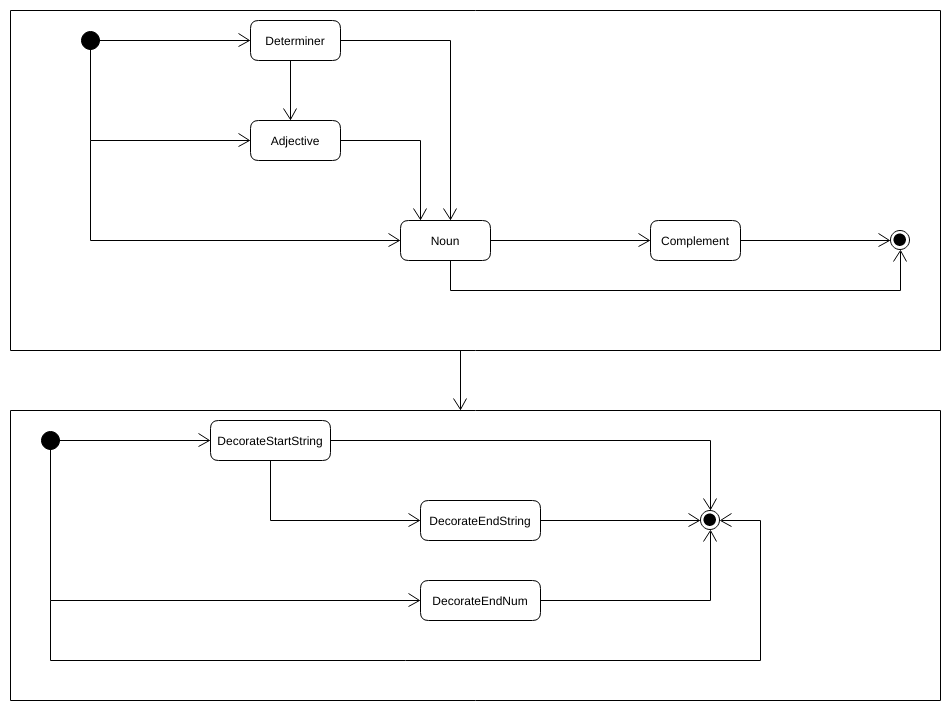

# Gotherator

A spoopy adventure with Markov Chain processes and username generation.

> <https://vapurrmaid.ca/Gotherator>

## Process

While the process is still WIP, it uses a probabilistic state transition to
continually transform a start string to its final spoopy version.

